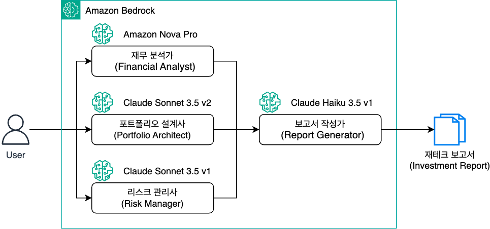
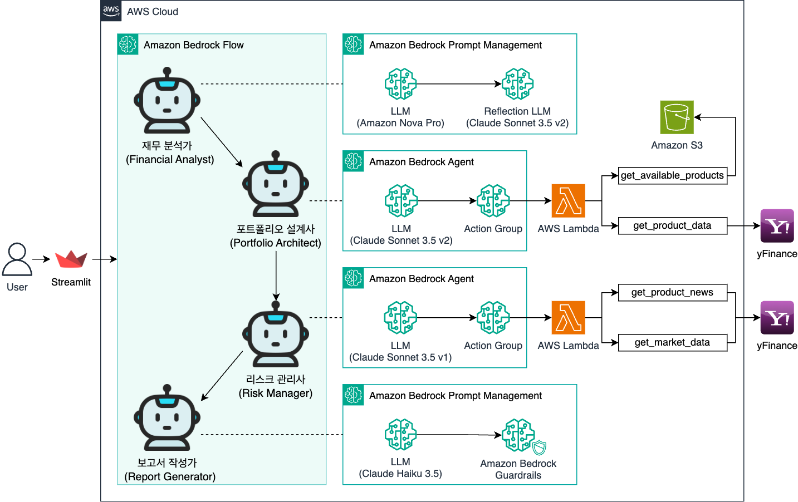

# Agentic AI Private Banker



재무 분석, 포트폴리오 설계, 리스크 관리를 통합한 AI 기반 개인 맞춤형 재테크 어드바이저 애플리케이션입니다.

## 아키텍처



이 애플리케이션은 다음과 같은 구성 요소들로 이루어져 있습니다:

1. **Streamlit Frontend**: 사용자 인터페이스 제공 및 분석 결과 시각화
2. **Amazon Bedrock Flow**: 여러 AI 에이전트들의 워크플로우 통합 및 조율
3. **Amazon Bedrock Agent**: 재무 분석, 포트폴리오 설계, 리스크 관리를 위한 특화된 AI 에이전트
4. **Amazon Bedrock Prompt Management**: LLM 호출을 위한 프롬프트 관리
5. **AWS Lambda**: 실시간 시장 데이터 처리 및 분석
6. **Yahoo Finance API**: 실시간 금융 데이터 및 뉴스 제공

## 주요 기능

### 1. 재무 분석 (Financial Analyst)
- 사용자의 재무 상황 종합 분석
- 위험 성향 평가
- Agentic AI Pattern : Reflection

### 2. 포트폴리오 설계 (Portfolio Architect)
- 실시간 시장 데이터 기반 포트폴리오 제안
- 입력받은 투자 상품 기반 자산 배분
- Agentic AI Pattern : Tool Use

### 3. 리스크 관리 (Risk Manager)
- 실시간 뉴스 기반 리스크 분석
- 시나리오별 포트폴리오 조정 전략
- Agentic AI Pattern : Planning

### 4. 종합 보고서 (Report Generator)
- 맞춤형 투자 제안서 생성
- 상세 투자 근거 제시

### 5. 프라이빗 뱅커 (Private Banker)
- 여러 AI 에이전트들의 워크플로우 통합 및 조율
- Agentic AI Pattern : Multi-llm


## 설치 및 실행

1. 필요한 패키지 설치:
```bash
pip install -r requirements.txt
```

2. 환경 변수 설정:
```bash
export BWB_FLOW_ID=your_flow_id
export BWB_FLOW_ALIAS_ID=your_flow_alias_id
export BWB_BEDROCK_REGION_NAME=your_region
```

3. 애플리케이션 실행:
```bash
streamlit run ai_pb_app.py --server.port 8080
```